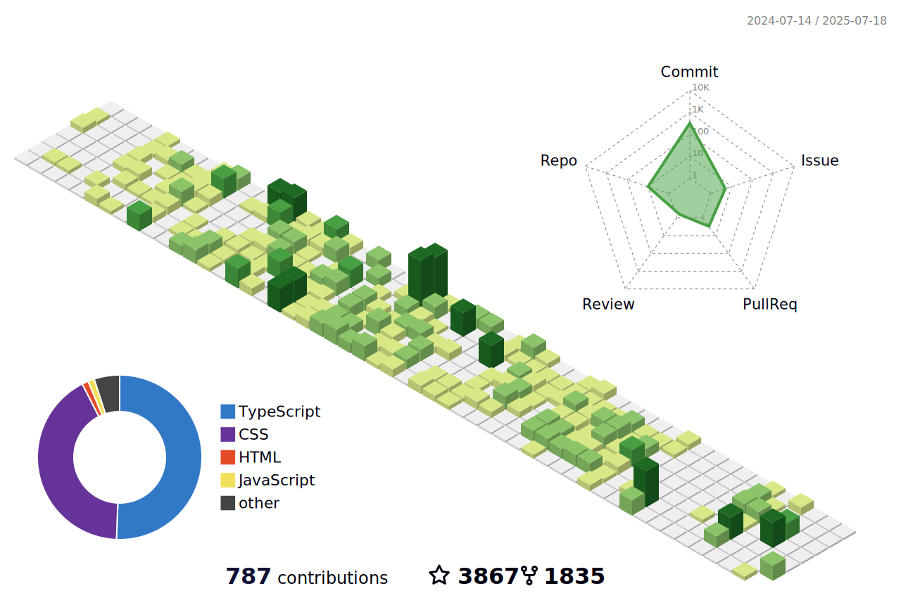

<!-- 动态 Banner 图片 -->

  

<!-- 自我介绍与标语 -->
<h1 align="center"> Hello 👋 I'm Geekstrange </h1>
<h3 align="center"> Full-Stack Developer | Open-Source Explorer </h3>
> "Some days you bloom, some days you grow roots. Both matter." 🌱

<!-- GitHub 统计卡片 -->

  
  

<!-- 3D 贡献日历 (需先配置 Action) -->

  

<!-- 技术栈图标 -->
<h3> 🛠️ Tech Stack</h3>

  
  
  
  

<!-- 社交链接 (统一徽章风格) -->
<h3> 🌐 Connect with Me</h3>

  
  
  
  
  

